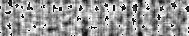
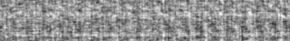
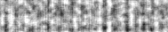
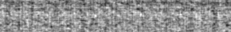
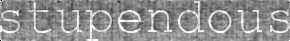
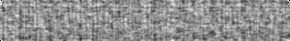
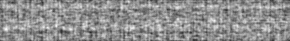

# randphase
Python functions for generating phase-randomised images of text. Fourier transform is used to extract amplitude. Inverse Fourier transform is used to generate an image with the same amplitude spectrum but with phase generated from uniformly distributed noise or a permutation of the original image's phase (preserving the overall distribution of phase values).

## Drawing Text

The `draw.text()` function can be used to create an image of text.

```python
import draw
text_im = draw.text('erudition', size=50)
text_im.show()
```


This can be cropped to the extremities of the target text (as above), or to the maximum size available to the given number of ascii characters for the target font (for x and y separately).

```python
crop1 = draw.text('brine', size=50, crop_x = 'font', crop_y='font')
crop2 = draw.text('bring', size=50, crop_x = 'font', crop_y='font')
crop3 = draw.text('WWWWW', size=50, crop_x = 'font', crop_y='font')
crop1.show()
crop2.show()
crop3.show()
```


You can also use different fonts, colours, backgrounds, and alignment (British spelling for 'centre' and 'colour').

```python
text_spec = draw.text('fancy', font='BRUSHSCI.TTF', colour=(255,127,0), bg=(100,0,100),
                      border=(0,0,10,10), size=75, crop_x='font', align_x='centre')
text_spec.show()
```


## Randomising Phase

To randomise the phase of an image with normally distributed noise, use `phase.randomise()`. This can be drawn from a uniform distribution (between  and ), or from a random permutation of the original phase values.

```python
import phase
im = draw.text('erudition', size=50, font='courbd.ttf')
rp_im = phase.randomise(im, noise='uniform')
pp_im = phase.randomise(im, noise='permute')
im.show()
rp_im.show()
pp_im.show()
```





For text, this will occasionally lead to contrast artefacts, seen as black spots in the images above. This can be remedied with the `contrast_adj` argument, which proportionally alters the image's contrast before running the Fourier transform, and then reverts the result to the original image's contrast.

```python
rp_im_adj = phase.randomise(text_im, noise='uniform', contrast_adj=0.5)
pp_im_adj = phase.randomise(text_im, noise='uniform', contrast_adj=0.5)
im.show()
rp_im_adj.show()
pp_im_adj.show()
```





You can also control the proportion of the phase information which is noise.

```python
u_010 = phase.randomise(im, noise_prop=0.1, contrast_adj=0.5)
u_025 = phase.randomise(im, noise_prop=0.25, contrast_adj=0.5)
u_050 = phase.randomise(im, noise_prop=0.50, contrast_adj=0.5)
u_075 = phase.randomise(im, noise_prop=0.75, contrast_adj=0.5)
u_100 = phase.randomise(im, noise_prop=0.100, contrast_adj=0.5)
im.show()
u_010.show()
u_025.show()
u_050.show()
u_075.show()
u_0100.show()
```







This will work on text generated by `draw.text()`, or any other PIL image. If the image has RGBA channels, phase will be randomised across colour and alpha channels as well. Here is a summary of some example output from `phase.randomise()` (all with no contrast adjustment):


## Dependencies

* `PIL`
* `numpy`
