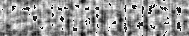
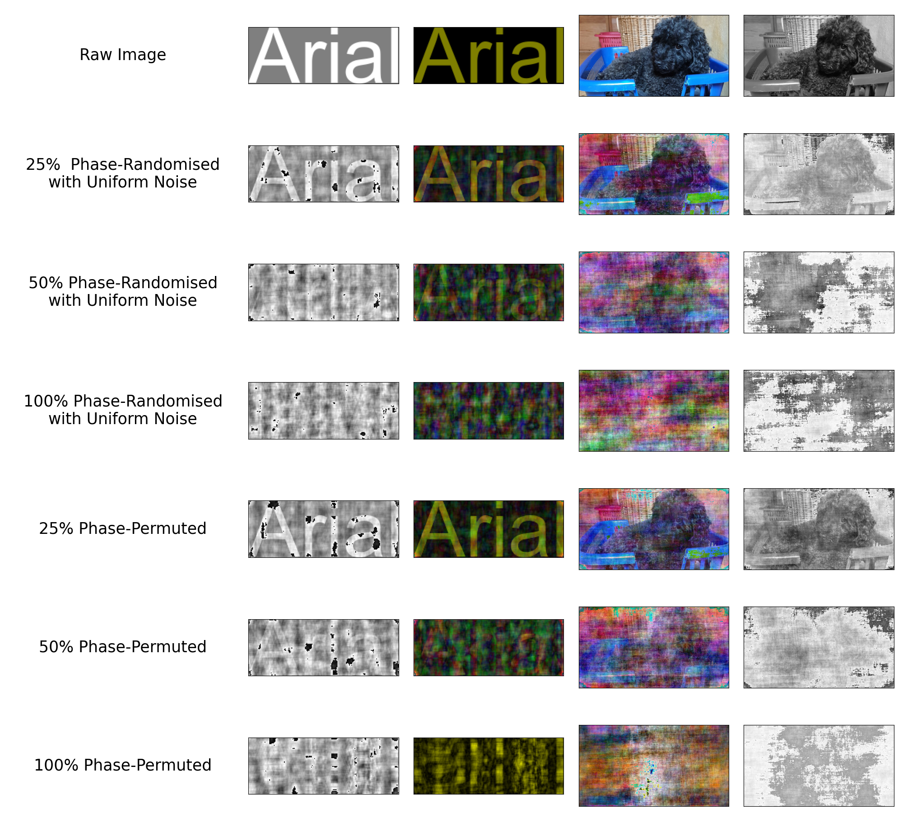

# randphase
Python functions for generating phase-randomised images of text. Fourier transform is used to extract amplitude. Inverse Fourier transform is used to generate an image with the same amplitude spectrum but with phase generated from normally or uniformly distributed noise.

## Summary

The `draw.text()` function can be used to create an image of text.

```python
import draw
raw = draw.text('erudition', size=50, crop_to='text')
raw.show()
```


To randomise the phase of an image with normally distributed noise, use `phase.randomise()`

```python
import phase
rp = phase.randomise(text_img, noise='normal')
rp.show()
```



## Example Outputs



## Notes

* `draw.text()` also accepts different fonts, colours, background colours, and font sizes.
* `draw.text()` has a `border` argument which can be used to specify a border around the crop.
* `draw.text()` has a `crop_to` argument, so the generated image is either cropped to the extremities of the text (`crop_to='text'`), or the extremities of the font (`crop_to='font'`).
* `phase.randomise()` accepts any PIL image, and can work with colour or greyscale images.

## Dependencies

* `PIL`
* `numpy`
